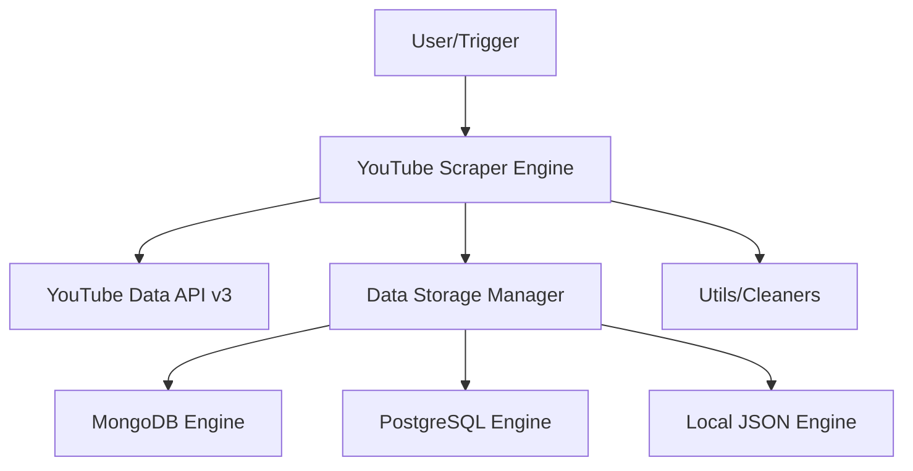

# 🔍 YouTube Scraper (Infinite Pipeline)
**High-Efficiency Data Extraction for Content Intelligence**

[](https://github.com/google/gemini-cli)
[](https://www.python.org/)
[](https://www.mongodb.com/)
[](https://opensource.org/licenses/MIT)

**YouTube Scraper** is a professional data extraction pipeline designed for large-scale YouTube channel analysis. It implements quota-efficient playlist traversal and supports multi-engine storage across MongoDB, PostgreSQL, and local JSON.

`✅ Infinite Data Pipeline | ✅ Multi-Engine Storage | ✅ MIT Licensed | ✅ Quota-Efficient`

## 🏗 Architecture
The scraper uses a provider-pattern architecture for storage and a generator-based pipeline for efficient API traversal.



### Core Components
- **Scraper Engine (`youtube_scraper.py`)**: Handles API authentication, rate limiting, and infinite playlist traversal.
- **Storage Manager (`data_storage.py`)**: Abstract base class for implementing surgical storage logic across different DB engines.
- **UI Hub (`app.py`)**: Streamlit-based dashboard for real-time progress tracking and configuration.
- **Utils (`utils.py`)**: High-performance data cleaning, deduplication, and engagement score calculation.

## 🚀 Getting Started

1. **Install Dependencies**:
   ```bash
   pip install -r requirements.txt
   ```

2. **Configure Environment**:
   Create a `.env` file with your `YOUTUBE_API_KEY`.

3. **Run the Scraper**:
   - **CLI**: `python youtube_scraper.py`
   - **UI**: `streamlit run app.py`

## 📜 License
This project is licensed under the **MIT License** - see the [LICENSE](LICENSE) file for details.

---
*Built with ❤️ for Content Intelligence.*
